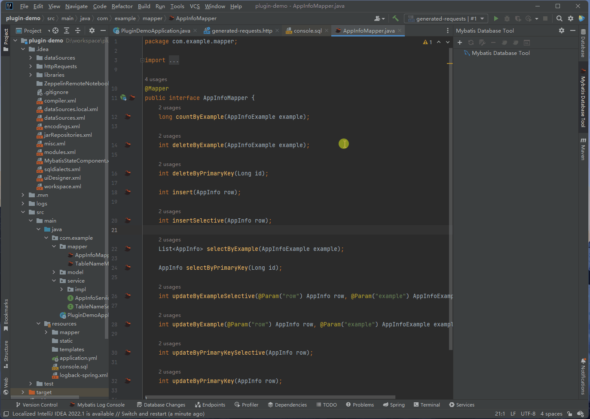
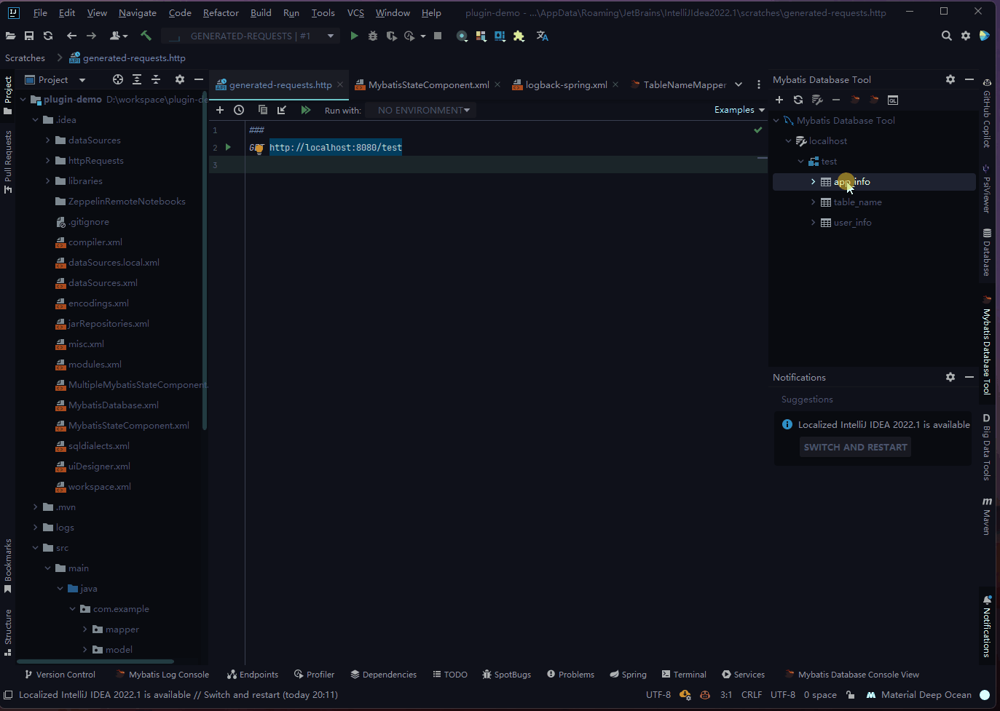
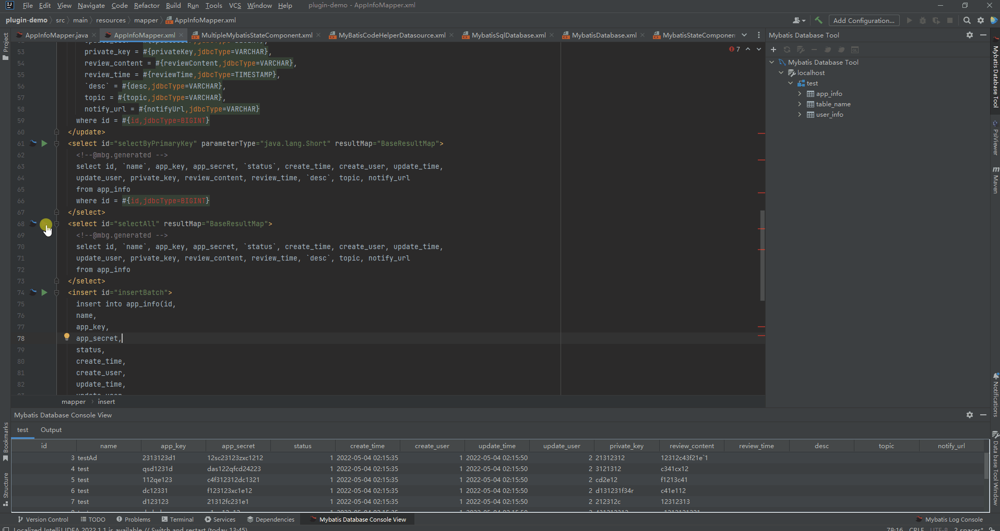
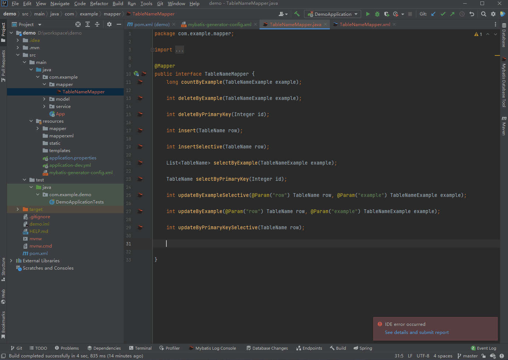
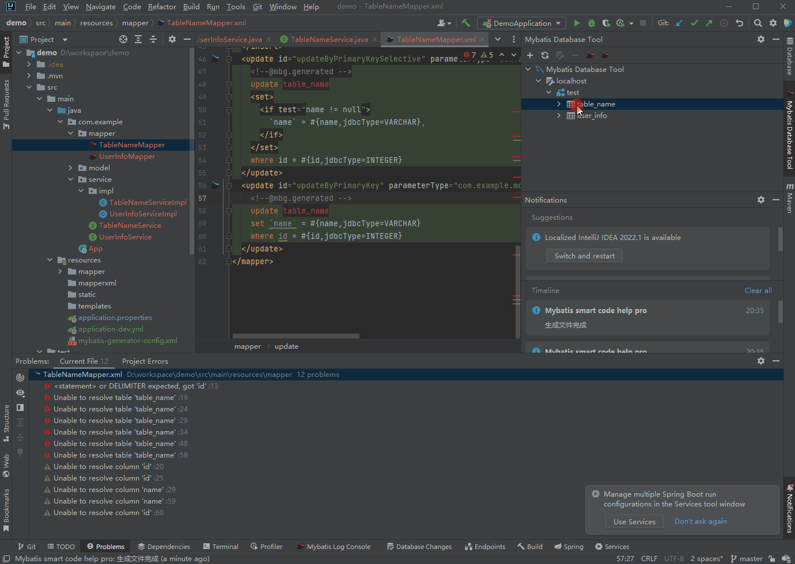
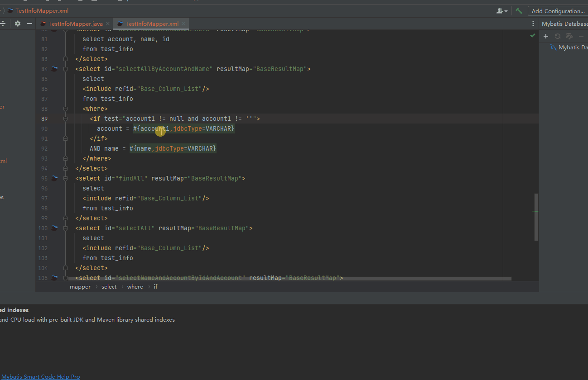
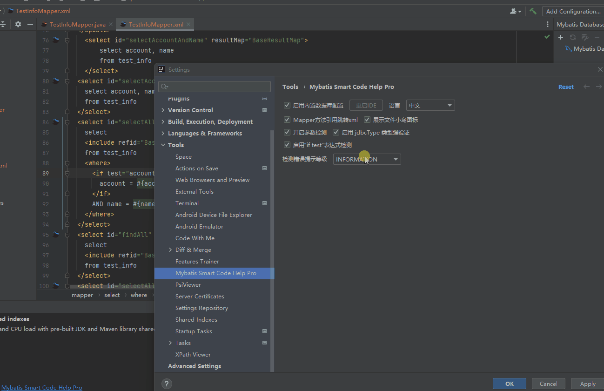
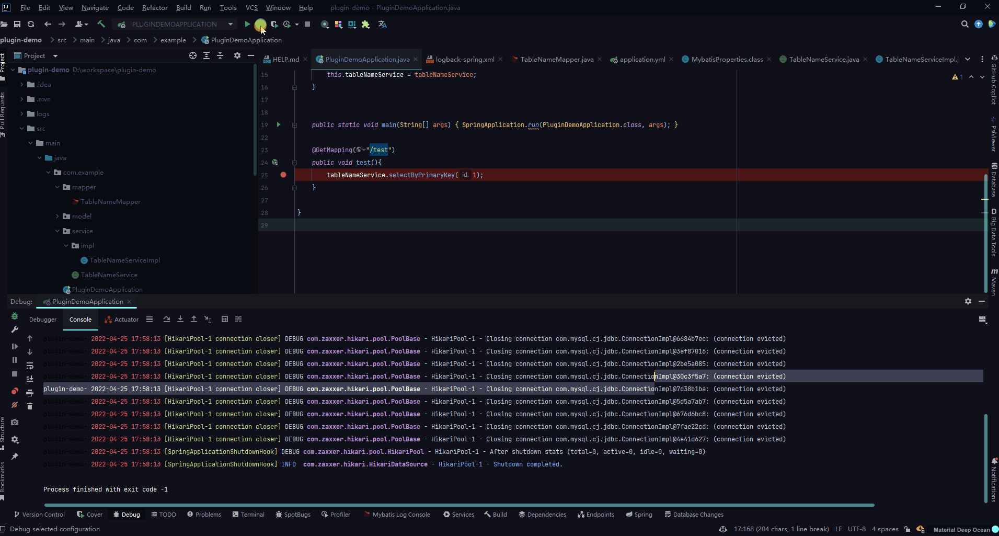

## 快速开始

### 功能

| ``功能点 ``                                                       | ``是否支持`` | ``插件版本``  |
|----------------------------------------------------------------|----------|-----------|
| 支持配置DAO SERVICE 等基本信息的一键生成                                     | ✔        | 2022.1.1+ |
| 支持@Data 等常见注解的使用                                               | ✔        | 2022.1.1+ |
| 支持XML 属性自动映射实体和数据库表字段                                          | ✔        | 2022.1.1+ |
| 支持XML 编辑自动提示                                                   | ✔        | 2022.1.1+ |
| 支持XML collection中的 参数检测                                        | ✔        | 2022.1.1+ |
| 支持Dao方法自动生成Sql                                                 | ✔        | 2022.1.1+ |
| 支持Service根据不同模式生成                                              | ✔        | 2022.1.1+ |
| 支持@trim 实体类去除空格                                                | ✔        | 2022.1.1+ |
| 支持XML sql自动生成Dao方法~~                                           | ✔        | 2022.1.1+ |
| 支持自定义数据库工具,使用方法和idea 自带的一样,满足在社区版中使用                           | ✔        | 2022.1.1+ |
| 支持TK mapper                                                    | ✔        | 2022.1.1+ |
| 数据库配置支持oracle                                                  | ✔        | 2022.1.1+ |
| 支持Service mapper 方法直接跳转到xml文件                                  | ✔        | 2022.1.1+ |
| 支持多表单独定义一键生成                                                   | ✔        | 2022.1.1+ |
| 支持动态启动内置数据库工具                                                  | ✔        | 2022.1.1+ |
| 检测mapper方法是否在xml文件中实现,并且提供一键生成xml方法                            | ✔        | 2022.1.1+ |
| 检测mapper返回值是否和xml一致                                            | ✔        | 2022.1.1+ |
| 支持国际化                                                          | ✔        | 2022.1.1+ |
| 支持Mybatis plus3                                                | ✔        | 2022.1.1+ |
| 支持mybatis sql 日志的抓取和格式化输出                                      | ✔        | 2022.1.1+ |
| 表配置UI增加字段注释展示                                                  | ✔        | 2022.1.1+ |
| 自定义数据库配置支持一键导入项目数据库配置                                          | ✔        | 2022.1.1+ |
| 支持Xml文件#{}参数跳转到方法或者实际使用类字段                                     | ✔        | 2022.1.1+ |
| 支持xml 文件Mybatis 参数检测和快速修复                                      | ✔        | 2022.1.1+ |
| 支持xml 文件Mybatis 参数检测                                           | ✔        | 2022.1.1+ |
| 支持mybatis log 窗口统一收集项目mybatis sql并且构建成可以直接执行的sql               | ✔        | 2022.1.1+ |
| 支持mybatis param参数跳转                                            | ✔        | 2022.1.5+ |
| 支持mybatis param 参数重构                                           | ✔        | 2022.1.5+ |
| 支持mybatis if test 表达式 重构                                       | ✔        | 2022.1.5+ |
| 支持mybatis if test 表达式 跳转                                       | ✔        | 2022.1.5+ |
| 支持生成批量更新方法                                                     | ✔        | 2022.1.1+ |
| 支持手动选择mybatis sql日志转成sql并执行                                    | ✔        | 2022.2.0+ |
| 支持插件数据库直接执行sql脚本                                               | ✔        | 2022.2.0+ |
| 支持连接数据库属性字段配置                                                  | ✔        | 2022.2.0+ |
| 支持动态插件图标配置                                                     | ✔        | 2022.2.0+ |
| 执行mybatis Xml Sql语句解析和快速测试                                     | ✔        | 2022.2.5+ |

   ### 讨论群

   [快速加入](https://qm.qq.com/cgi-bin/qm/qr?k=2OxKmoCNOEY3KmfvWENscQmAwpKfkfR2&jump_from=webapi)

## 配置插件

   ### 配置数据库
     - 使用IntelliJ IDEA Ultimate 版本的，配置好项目中使用的数据库信息,可以得到内置的高级提示
   - 
    
    - 配置好数据库之后,开发工具还需要知道项目里面sql语句是哪个数据库的,所以我们还要配置下数据库对应的方言,方言不同，提示和检测的信息不同，请选择正确。
   - 
      
    - .如果配置了多个数据库,还需要再次配置
   - 

   ### 配置插件图标

 - 

## 数据库

   ### Ultimate 版本自带的Database 生成

     选择右则栏位Database,点击要生成的表,如果想要多表生成，同时选择多张表,3 位置表示单表生成, 4位置表示夺标生成
     配置代码生成位置
       1.要生成的表名 
       2.生成之后类名称 
       3.去除前缀,比如sys_user,想要生成User 就要在这里面输入sys   
       4.多模块的时候,要选择生成在哪个module中
       5.要生成的类存放包名路径(只要java目录下的包路径就可以)
       6.model存放工程目录,eg：D:\workspace\demo\src\main\java
       7.要生成的mappper存在包路径(只要java目录下的包路径就可以)
       8.mapper存放的工程目录，eg：D:\workspace\demo\src\main\java
       9.生成mapper xml 文件对应的包名(resource下面的文件名称就可以了)
       10.mapper xml文件存放工程目录，eg：D:\workspace\demo\src\main\resources
       11.简易模式会忽略example命名的方法,完整模式则会生成全部的方法,纯净模式则不会生成方法,只会生成类
       12.service接口所在的包名称(只要java目录下的包路径就可以)
       13.service接口对应的工程目录eg：D:\workspace\demo\src\main\java
       14.service实现类所在的包名称(只要java目录下的包路径就可以)
       15.service实现类对应的工程目录eg：D:\workspace\demo\src\main\java
- 

       配置数据库表字段信息
       可以调整要生成的字段级别信息,类型
-  

        额外生成信息配置
- 

         配置好了之后,直接点击完成

## 社区版生成

   ### 先查看插件是否激活成功

 - 
       - 
     
       激活插件成功之后,还要去配置中查看插件带的数据库工具是否开启,选择勾选启动内置数据库工具
       File | Settings | Tools | Mybatis Smart Code Help Pro | Project Setting
 - 

       勾选之后,点击重起idea,这个时候在右则就有数据库工具图标出来了
 - 

       点击+来添加数据库配置,可以选择点击导入配置按钮来快速导入数据库的配置
       目前只支持spring boot 自带的数据库配置,确保配置文件中有配置数据库,yml 和property文件的都支持解析
        - 
       支持一键自动下载驱动文件
 - 
      
       支持选择数据库类型和驱动版本
 - 

       后续生成操作就和Ultimate自动的一样操作就可以了

### 代码合并方式

    -  代码合并如果在额外配置界面勾选了生成注释,则mybatis 内置的方法会进行覆盖,其他的方法合并的方式处理
    -  如果在额外配置界面没有勾选生成注释,则可能不会进行覆盖,会出现重复方法,建议勾选生成注释，当前本插件中
      已经使用了他们官网提供的不勾选生成注释也可以进行合并覆盖的插件进行处理

### 一键生成mybatis generator的XMl文件

-  

### 配置数据库连接属性

- 

### 快速查询表数据

  - 双击表名进行快速查询表数据 
    - 

### sql文件执行sql语句

- 

## Xml Sql语句解析和执行
- 

## 方法名生成sql
 ### -  根据mapper方法名称生成sql
 - 
 ### - 根据mapper方法名称生成sql(带if test)
 - 
 ### - 生成findAll和selectAll方法
 - 
 ### - 生成insertAll和insertBatch方法
 - 
 ### - 生成updateBatch和updateBatchSelective方法
 - 

## 自动补全和参数检测

   ### - xml param 自动补全
   - 
   ### - param检测是否正确和类型是否正确
   - 
   ### - if test 参数自动补全
   - 
   ### - resultMap property检测和补全
   - 
   ### - resultMap中的collection association自动补全
   - 

## Mybatis日志拦截

   ### - mybatis日志拦截,并且自动格式化sql和填充参数
   - 
   ### - Mybatis sql 日志 手动选择,一键转成sql语句,并且可以直接执行看到语句结果
   - 此功能需配置idea旗舰版Database Tool数据库配置或者插件自带的数据库配置
   - 如果Database Tool数据库和插件自带数据库都配置了,优先使用Database Tool
   - 数据库配置,并且直接使用Database Tool console.sql功能进行sql的执行
   - 如果只配置了插件自带的数据库,则使用插件内置的界面进行数据展示
   - 
   ### Mybatis sql日志拦截配置
   - 

## Reference project

    MybatisX: https://github.com/baomidou/MybatisX
   
    mybatis-lite: https://plugins.jetbrains.com/plugin/10921-mybatis-lite
   
    MyBatisCodeHelper-Pro: https://github.com/gejun123456/MyBatisCodeHelper-Pro
