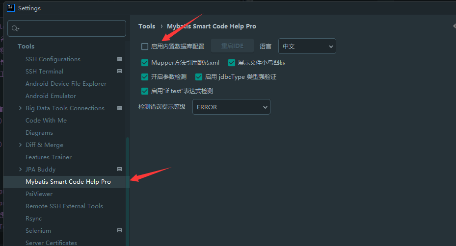

## quick start

### Features

| function points                                                                                                                           | Free version | Paid version |
|-------------------------------------------------------------------------------------------------------------------------------------------|--------------|--------------|
| Support one-click generation of basic information such as configuration DAO SERVICE                                                       | ✔            | ✔            |
| Support the use of common annotations such as @Data                                                                                       | ✔            | ✔            |
| Supports XML attributes to automatically map entities and database table fields                                                           | ✔            | ✔            |
| Supports XML editing auto-suggestion                                                                                                      | ✔            | ✔            |
| Support parameter detection in XML collection                                                                                             | ✔            | ✔            |
| Support Dao method to automatically generate Sql                                                                                          | ✔            | ✔            |
| Support Service to be generated according to different modes                                                                              | ✔            | ✔            |
| Supports @trim entity classes to remove spaces                                                                                            | ✔            | ✔            |
| Support XML sql to automatically generate Dao method~~                                                                                    | ✔            | ✔            |
| Supports custom database tools, the usage method is the same as the one that comes with idea, and it can be used in the community edition | ✔            | ✔            |
| Support TK mapper                                                                                                                         | ✔            | ✔            |
| Database configuration supports oracle                                                                                                    | ✔            | ✔            |
| Support Service mapper method to jump directly to xml file                                                                                | ✔            | ✔            |
| Support multi-table definition one-key generation                                                                                         | ✔            | ✔            |
| Supports dynamic startup of built-in database tools                                                                                       | ✔            | ✔            |
| Detect whether the mapper method is implemented in the xml file, and provide a one-click generation xml method                            | ✔            | ✔            |
| Check whether the return value of mapper is consistent with xml                                                                           | ✔            | ✔            |
| Support internationalization                                                                                                              | ✔            | ✔            |
| Support Mybatis plus3                                                                                                                     | ✘            | ✔            |
| Supports mybatis sql log capture and formatted output                                                                                     | ✘            | ✔            |
| Add field comment display to table configuration UI                                                                                       | ✘            | ✔            |
| Custom database configuration supports one-click import of project database configuration                                                 | ✘            | ✔            |
| Support Xml file #{} parameter to jump to method or actually use class field                                                              | ✘            | ✔            |
| Support xml file Mybatis parameter detection and quick repair                                                                             | ✘            | ✔            |
| Support xml file Mybatis parameter detection                                                                                              | ✘            | ✔            |
| Support mybatis log window to collect project mybatis sql and build it into sql that can be executed directly                             | ✘            | ✔            |
| Support mybatis param parameter jumping                                                                                                   | ✘            | ✔            |
| Support mybatis param parameter refactoring                                                                                               | ✘            | ✔            |
| Support mybatis if test expression refactoring                                                                                            | ✘            | ✔            |
| Support mybatis if test expression jump                                                                                                   | ✘            | ✔            |

## configuration database

- Use IntelliJ IDEA Ultimate version, configure the database information used in the project, you can get built-in advanced tips
- 
- After configuring the database, the development tool also needs to know which database the SQL statement in the project belongs to, so we also need to configure the dialect corresponding to the database. Different dialects have different prompts and detection information, please choose the correct one.
- 
- .If multiple databases are configured, you need to configure again
- 

## database generation code

### Database generation that comes with the Ultimate version

    - Select the right column Database, click on the table to be generated, if you want to generate multiple tables, select multiple tables at the same time, the 3 position means single table generation, and the 4 position means outright generation
    - 
    - Configure code generation location
      - 1. The name of the table to be generated
      - 2. Class name after generation
      - 3. Remove the prefix, such as sys_user, if you want to generate a User, you need to enter sys in it
      - 4. When there are multiple modules, you need to choose which module to generate
      - 5. The class to be generated stores the package name path (as long as the package path in the java directory is ok)
      - 6.model store the project directory, eg: D:\workspace\demo\src\main\java
      - 7. The mappper to be generated has a package path (as long as the package path in the java directory is ok)
      - 8. The project directory stored by mapper, eg: D:\workspace\demo\src\main\java
      - 9. Generate the package name corresponding to the mapper xml file (the file name under resource is fine)
      - 10. The mapper xml file stores the project directory, eg: D:\workspace\demo\src\main\resources
      - 11. Simple mode will ignore the method named example, full mode will generate all methods, pure mode will not generate methods, only classes will be generated
      - 12. The name of the package where the service interface is located (as long as the package path in the java directory is ok)
      - 13. The project directory corresponding to the service interface eg: D:\workspace\demo\src\main\java
      - 14. The name of the package where the service implementation class is located (as long as the package path in the java directory is ok)
      - 15. The project directory corresponding to the service implementation class eg: D:\workspace\demo\src\main\java
    - 
    - Configure database table field information
     - The type of field-level information to be generated can be adjusted
    - 
    - Additional build information configuration
    - 
    - After the configuration is complete, click Finish

### Community edition build

     - Check if the plugin is activated successfully
       - 
       - 
     - After the activation of the plugin is successful, go to the configuration to check whether the database tool with the plugin is enabled, and select to start the built-in database tool
        - File | Settings | Tools | Mybatis Smart Code Help Pro
        - 
     - After checking it, click to restart the idea, at this time there will be a database tool icon on the right
        - 
     - Click + to add the database configuration, you can choose to click the import configuration button to quickly import the database configuration, currently only supports spring boot
        The built-in database configuration ensures that there is a configuration database in the configuration file, and both yml and property files support parsing
        - 
    - Support one-click automatic download of driver files
        - 
    - Support selection of database type and driver version
        - 
    - The subsequent generation operation is the same as the automatic operation of Ultimate.

### code merging

   - Code merging If the Generate Comment is checked in the additional configuration interface, the built-in method of mybatis will be overwritten, and other methods will be merged.
   - If you do not check Generate Comments in the additional configuration interface, it may not be overwritten, and there will be duplicate methods. It is recommended to select Generate Comments. Currently in this plugin
    The plugins provided by their official website that can be merged and covered without checking the generated comments have been used for processing

## method name to generate sql

    ### -  Generate sql based on mapper method name
        - 
    ### - Generate sql based on mapper method name (with if test)
        - 
    ### - Generate findAll and selectAll methods
        - 

## Autocompletion and parameter detection

    ### - xml param autocompletion
        - 
    ### - param check is correct and the type is correct
        -  
    ### - if test parameter auto-completion
        - 
    ### - resultMap property detection and completion
        - 
    ### - Collection association auto-completion in resultMap
        - 

## Mybatis log interception

    ### - mybatis log interception, and automatically format sql and fill parameters
        - 

## demo

- Plugin
  settings
- jumps
- quick
  fix
- Custom database configuration and one-click import project database
  configuration
- One-click generation of single-table or multi-table
  CURD
- Mybatis xml parameter one-click completion and parameter
  jump
- Detect parameters and hints and
  fixes
- Parameter quick
  fix
- mybatis sql log
  collection

## pending function

- ~~Support one-key refactoring of xml parameters, etc.~~
  Reference project

  MybatisX: https://github.com/baomidou/MybatisX

  mybatis-lite: https://plugins.jetbrains.com/plugin/10921-mybatis-lite

  MyBatisCodeHelper-Pro: https://github.com/gejun123456/MyBatisCodeHelper-Pro
